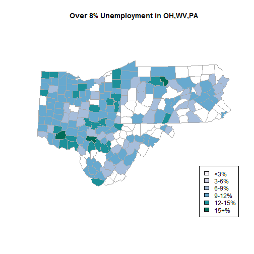

## Purpose:
### Interactive shiny app to color maps from the "unemp" dataset.   

### 4 Interactive Features:
+ User map title
+ Range slider (two values) to select unemployment range
+ State selector (selectizeInput)
+ Update button to make reactive changes    

### Calculations performed include:
+ Reconfigure db to include only selected states, counties within unemp % range
+ Match colors to appropriate unemployment figures
+ Enter the user's title 
+ Calculate states' average unemployment
+ Summarize states' total population

--- .class #id 

## R Code to generate the maps:


```r
            plot_db$colorBuckets <- as.numeric(cut(plot_db$unemp, c(0, 3, 6, 9, 12, 15, 100)))
            plot_db$colorBuckets[plot_db$unemp < (pct_range[1])]=100
            plot_db$colorBuckets[plot_db$unemp > (pct_range[2])]=100            
            
            map("county", regions = states, col = colors[plot_db$colorBuckets], 
                fill = TRUE,resolution = 0,lty = 0, projection = "polyconic")
            title(map.title)
            leg.txt <- c("<3%", "3-6%", "6-9%", "9-12%", "12-15%", "15+%")
            legend("bottomright", leg.txt, horiz = FALSE, fill = colors)
            
            ## Add border around each county
            map("county", regions = states, col = "darkgrey", fill = FALSE, add = TRUE, 
                lty = 1, lwd = 0.2, projection = "polyconic")
```

---

### Example Results: (open "index.Rmd" to see original code)
 

```
##           state     unemp total$pop counties$count
## 1          ohio 10.714773   5876843             88
## 2  pennsylvania  8.728358   6351110             67
## 3 west virginia  9.114545    791448             55
```

---

## Lessons Learned from Project    

+ Shiny, shinyapps.io, slidify, html usage within shiny, UI reactivity
+ Panels, tabsets, user help, page layouts
+ Use of "browser()" to troubleshoot shiny programs (critical)
+ Reactivity and how to program it effectively
+ This is great stuff!
